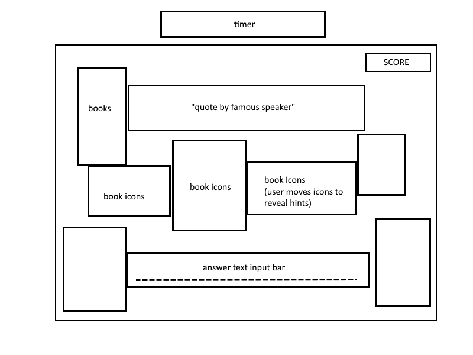

## Who Said That? Guess the Speaker!

### Background

Who Said That? gives you a quotation and you have to guess the speaker. The game give you three hints and then give you a score, deducting a point for each hint activated, at the end of the game at how well you know the 10 moderately famous quotes. With each hint, we'll display a provide a hint to give more context about the quotation in creative ways such as pictures and perhaps audio clips.

### Functionality & MVP

With Who Said That!, users will be able to:

- [ ] Start, pause, and reset the game
- [ ] Answer questions and select hints
- [ ] Render book icons to hide hints
- [ ] See pictures of the speaker after each question

In addition, this project will include:

- [ ] An About sidebar
- [ ] A view window for the DOM
- [ ] A production Readme

### Wireframes

This app will consist of a single screen with game board, game controls, and nav links to the Github, my LinkedIn, and an About sidebar with game directions. Game controls will include Start, Stop, and Reset buttons that can be activated via cursor or keyboard shortcuts. The about sidebar is next to the game window. The game window will have a score box at the top right hand corner. The score will measure either hints use or time to figure out the quotes. Each question will display quote at the center top. There is a text input bar that requires either exact match for the speaker or just their last name. The hints will be hidden under book icons that will be dragged out of the way, revealing the quote, thus incorporating Easel.js. After each question, display a picture of the speaker.

### Architecture and Technologies

This project will be implemented with the following technologies:

- JavaScript and `React` for overall structure and game logic,
- `Easel.js` with `HTML5 Canvas` for DOM manipulation and rendering,
- Webpack to bundle and serve up the various scripts.

In addition to the webpack entry file, there will be three scripts involved in this project:

`game.js`: this script will handle the logic for creating and updating the necessary `Easel.js` elements and rendering them to the DOM.

`sidebar.js`: game instructions and keyboard commands

`score.js`: this script will handle the scoring logic behind the scenes, devising a score based on time.

`hint.js`: this lightweight script will house the `hint` objects, placing them randonmly in the game window, being hidden by the book icons powered by `Easel.js` that can be dragged or dropped out of the way.

### Implementation Timeline

**Day 1**: Setup all necessary Node modules, including getting webpack up and running and `Easel.js` installed.  Create `webpack.config.js` as well as `package.json`.  Write a basic entry file and the bare bones of all 3 scripts outlined above.  Gain fluency in `Easel.js`.  Goals for the day:

- Get a green bundle with `webpack`
- Learn enough `Easel.js` to render an object to the `Canvas` element
- Style a sharp 'instructions box'

**Day 2**: Dedicate this day to learning the `Easel.js` API.  First, build out the `hint.js` object to connect to the `Game` object.  Then, use `game.js` to create and render at least one question and associated hints, hidden by the book icons, powered by `Easel.js`.  Build in the ability to move books to reveal quotes.  Goals for the day:

- Complete the `game.js` module (constructor, update functions)
- Render the books to the `Canvas` using `Easel.js`
- Render the famous speaker picture after each question.
- Make each book in the game window clickable
- Build in keyboard action rather than just cursor action

  **Day 3**: Create the `score.js` logic backend.  Build out logic for devising score based on time spent playing per question or on how many hints were viewed. Incorporate the logic into the `game.js` rendering.  Goals for the day:

- Have a functional grid on the `Canvas` frontend that correctly handles iterations from one generation of the game to the next

**Day 4**: Install the controls for the user to interact with the game.  Style the frontend, making it polished and professional.  Goals for the day:

- Tighten up the UI and graphics for the game, particularly the game instructions.

### Bonus features

There are many directions this cellular automata engine could eventually go.  Some anticipated updates are:

- [ ] Add options for different question sets
- [ ] Allow audio clips for hints
